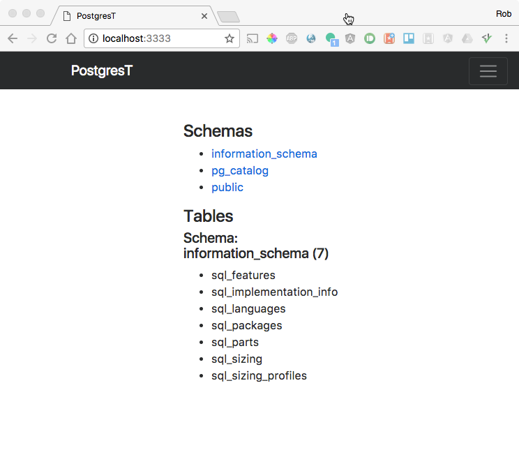

# PostgresT

Sample boilerplate application to get JSON out of Postgres using Restify on NodeJS runtime from HTML/JQuery.

## Warning - No security considerations - use at your own risk.

## Running...

* (Optional) nvm use
* npm install
* node app/index.js <web-server-port> <postgres-conn-url>
* open http://localhost:<web-server-port>

# Yields...

